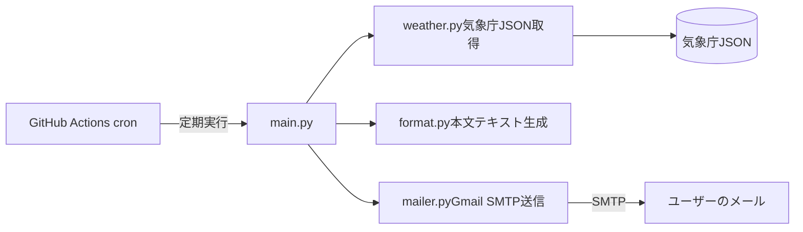

## 1.はじめに

毎晩、翌日の天気や気温、降水確率を確認するために天気アプリやSNSを開いたものの、ついついタイムラインやショート動画を眺めて時間を奪われてしまった経験はありませんか？

特に夕方〜夜の時間帯は、家事や育児、翌日の準備などで慌ただしく、必要な情報だけを短時間で確認したいという課題がありました。

そこで今回、「広告や誘惑の多いアプリを開かず、必要な生活情報だけを毎晩メールで受け取る」ことを目的とした自動通知システム daily-notifier を開発しました。

実際に届くメールは以下のような内容です。


この記事では以下を紹介します。

- システム全体の構成
- 気象庁JSONを採用した理由
- GitHub Actionsで定期実行
- GitHub Secretsを利用した機密情報管理

## 対象読者

- GitHub Actionsを使った個人開発に興味がある人
- Pythonで定期実行をやってみたい人
- 天気通知システムを作ってみたい人

## 2. システム構成と使用技術

### システムアーキテクチャ
GitHub Actionsのcronスケジューラを起点とし、Pythonスクリプトが気象庁の公開データ（JSON）を取得・整形の上、GmailのSMTP経由で指定のメールアドレスへ送信する構成です。
GitHub ActionsはGitHubが提供するCI/CDサービスです。
本プロジェクトではcron機能を利用し、サーバーを用意せず毎日Pythonスクリプトを自動実行しています。



### 使用技術・環境

| 項目         | 選定技術/環境   | 選定理由                                                                        |
| ------------ | --------------- | ------------------------------------------------------------------------------- |
| 言語         | Python 3.14.6   | データ抽出・テキスト操作が容易で、標準ライブラリ（smtplib等）が充実しているため |
| データソース | 気象庁 予報JSON | 認証 （APIキー）不要で、なじみのある日本語天気予報が取得できるため              |
| 実行基盤     | GitHub Actions  | サーバーレスで無料かつ安定したcron定期実行環境を構築できるため                  |
| 機密管理     | GitHub Secrets  | 送信元/送信先メールアドレスやアプリパスワードを安全に管理するため               |


## 3. モジュール分割
将来的な機能追加（通知先の変更や、ゴミ収集日などの情報追加）を見据え、単一のスクリプトで完結させず単一責任の原則（「1つのモジュールは1つの役割だけを担当する」という設計原則）を意識したモジュール構成にしています。

```Plaintext
daily-notifier/
├── .github/workflows/
│   └── daily_notify.yml
├── src/
│   ├── __init__.py
│   ├── config.py      # 環境変数・設定値の集約
│   ├── weather.py     # 気象データ取得ロジック
│   ├── format.py      # メール本文のフォーマット整形
│   └── mailer.py      # SMTPメール送信処理
├── main.py            # エントリーポイント（各モジュールの呼び出し）
├── requirements.txt
└── README.md
```

データ取得（weather.py）、テキスト整形（format.py）、外部送信（mailer.py）を疎結合に保つことで、例えば「通知先を変更する」といった際も mailer.py の差し替えのみで対応できるように設計しています。

## 4. 実装のポイント1 : 通知先としてのメール

通知先としてメールを採用した理由は、アプリやSNSを開く機会を減らすためです。

アプリを開くと、広告やショート動画などに注意が向き、情報収集に不必要に多くの時間を使ってしまうことがあります。

必要な情報だけをメールで受け取ることで、情報収集を短時間で終えられるデジタルデトックス環境を目指しています。

## 5. 実装のポイント2 : 気象データ取得元の選定

本システム開発にあたり、気象情報の取得先として 気象庁JSON と Open-Meteo の2つの候補を比較・検討しました。

取得先の比較検討

| 項目       | 気象庁JSON                                                                                                                                           | Open-Meteo API                                                                                                                                                       |
| ---------- | ---------------------------------------------------------------------------------------------------------------------------------------------------- | -------------------------------------------------------------------------------------------------------------------------------------------------------------------- |
| メリット   | -見慣れた日本語の気象表現がそのまま手に入る<br> -APIキー不要で手軽に利用できる                                                                       | -公式APIサービスで仕様変更の事前通知がある <br>- レスポンスの配列インデックスの対応が固定で扱いやすい <br>- 提供データ領域が豊富 <br>- APIキー不要で手軽に利用できる |
| デメリット | - 正式なAPIサービスではないため、突然の仕様変更・終了のリスクがある <br>- 取得時間によって配列の要素数が変化したり、インデックスの対応がズレたりする | - 全世界対応のため、天気コードを日本語表現に変換するロジックを自作する必要がある                                                                                     |

今回は個人開発のプロダクトであり、「突然の仕様変更リスクは許容できること」「見慣れた日本語の予報表現をそのまま使えること」を優先し、気象庁JSONを採用しました。

### 気象庁JSONの「インデックスズレ問題」とその解決策

気象庁JSONの仕様上、例えば降水確率データ（pops）は予報取得する時間帯によって配列の先頭（index[0]）が指す時間帯が変化するという癖があります。

```Plain
取得時刻：05時

index[0] → 06～12時の降水確率
index[1] → 12～18時の降水確率


取得時刻：11時

index[0] → 12～18時の降水確率
index[1] → 18～00時の降水確率
```

そのため、同じ index[0] でも取得時刻によって意味が変わるため、固定インデックスではなくtimeDefinesを基準に処理する必要があります。

この問題に対し、本システムでは値（バリュー）だけでなく対となる日時情報（キー/タイムスタンプ）もペアで取得してパースする実装を行いました。

```python
pop_text = ""

for rain in weather_info["rain_forecasts"]:
    pop_text += (
        f'{format_pop_datetime(rain["time"])}：'
        f'{rain["pop"]}%\n'
    )
```

キーとなる日時情報は、人間が理解しやすい形式に変更し、バリューとセットで表示しています。

```plain
降水確率：
8月4日12時～18時：20%
8月4日18時～00時：10%
8月5日00時～06時：10%
8月5日06時～12時：0%
8月5日12時～18時：10%
8月5日18時～00時：10%
```


## 6. 実装のポイント3: GitHub Actions cronの遅延検証

GitHub Actionsのcronは「設定時刻より遅れて実行されることがある」と知られていますが、実際の運用環境でどの程度の遅延が発生するかを把握するため、事前検証を行いました。

※ 検証方法と結果については、別途以下の記事にまとめています。

https://zenn.dev/wakinoza/articles/a5f2f56bb4abf0

検証の結果、私が平日日中に検証した環境では、およそ2〜4時間の遅延が確認できました。

このシステムが解決したい課題は「毎晩18:00〜20:00頃）の時間帯に、翌日の予報が届いていること」です。
そのため、遅延の発生を前提として以下のような運用設計を行いました。

- 設定時刻の逆算: 到着目標時刻（18:00）から遅延時間（2時間）を逆算し、cronのトリガーを JST 16:00（UTC 07:00） に設定。

- 許容設計: 2〜4時間の遅延が生じても、最終的に18:00〜20:00の間にメールが届けばプロダクトとしての目的は十分果たせます。

なお、この遅延問題については、今後抜本的な解消を目指す予定です。

## 7. 実装のポイント4 : セキュリティと安全なGit/GitHub運用の徹底

本プロジェクトでは、コードの安全性を確保し、リスクを最小限に抑えるため、
「機密情報」「Git運用」「Actions」の3つの観点から対策を実施しました。

### 1. 機密情報の保護

メールアドレスや認証情報は、ソースコード上に一切ハードコーディングしていません。

GitHub Actions : GitHub Secrets に暗号化して保存し、実行時のみ環境変数として安全に注入しています。

ローカル環境 : .env ファイルで機密情報を管理。「.env」は.gitignore に明記してgit管理から除外したのち、プロジェクト外に配置しています。.envをプロジェクト外に配置した理由は、開発にcodexを利用する際に、機密情報を読み取られないようにするためです。
.envの項目名のみ「.env.example」に記載し、プロジェクト内でgit管理しています。


### 2. Mainブランチ保護ルールの導入

個人開発であっても main ブランチへの直接コミットを禁止し、常にfeatureブランチからの Pull Request (PR) 経由でコードを取り込む運用にしています。

GitHubのリポジトリ設定にて、以下の保護ルール（Branch Protection Rules）を有効化しました。

✅ Require a pull request before merging
直接コミットを防止し、PRを作成して変更差分やCIの結果を確認するプロセスを強制。

✅ Do not allow bypassing the above settings
管理者（自分自身）であってもルールを回避（バイパス）して強制マージできないよう制約を設定。

今回は一人開発であるため、「Require approvals（他者による承認必須）」の設定は無効化して運用しています。

### 3. GITHUB_TOKEN の最小権限原則
GitHub Actions内で自動発行される GITHUB_TOKEN に対し、過剰な権限が付与されないよう、ワークフローファイル側で明示的に権限を読み取り専用（contents: read）に制限しました。

これにより、仮にサードパーティ製Actionの脆弱性や外部からの不正なPRによってスクリプトが実行された場合でも、被害を最小限に食い止める防衛的セキュリティを実現しています。


## 8. まとめと今後の展望

今回はMVP（Minimum Viable Product：最小限の機能を備えた最初の製品）として、

- GitHub Actionsによる毎晩の定期実行
- 気象庁JSONからの天気予報情報取得
- Gmailによる自動メール通知

までを構築できました。

スマホアプリの通知やSNSの誘惑に惑わされず、翌日の準備ができるようになり、日常のちょっとしたストレス軽減につながりました。

今後の拡張予定

- 気圧変化データの取得（Open-Meteo APIの活用）
- ゴミ収集日の通知
- 二十四節気・七十二候の取得
- AIによる通知テキストの要約・励ましメッセージ生成


ソースコードはGitHubで公開しています。
実装の詳細やディレクトリ構成も確認できます。

👉 GitHub リポジトリ: [daily-notifier](https://github.com/wakinoza/daily-notifier)


---

記事は以上です。

次回は、この開発の過程におけるAI活用の実例を紹介したいと思います。

最後までお読みいただき、ありがとうございました。

## 参考情報一覧

この記事は以下の情報を参考にして執筆しました。


- [気象庁JSONデータ](https://qiita.com/michan06/items/48503631dd30275288f7) (最終更新 2021-05-05) (参照 2026-08-04)
- [気象庁APIの無料活用方法完全ガイド【2026年版・天気予報・警報】](https://api-zukan.com/blog/jma-weather-api) (最終更新 2026-03-01) (参照 2026-08-04)
- [Open-Meteo.com](https://open-meteo.com/)  (参照 2026-08-04)
- [GitHub Actions でのシークレットの使用](https://docs.github.com/ja/actions/how-tos/write-workflows/choose-what-workflows-do/use-secrets)  (参照 2026-08-04)
- [ブランチ保護ルールを管理する](https://docs.github.com/ja/repositories/configuring-branches-and-merges-in-your-repository/managing-protected-branches/managing-a-branch-protection-rule)  (参照 2026-08-04)

