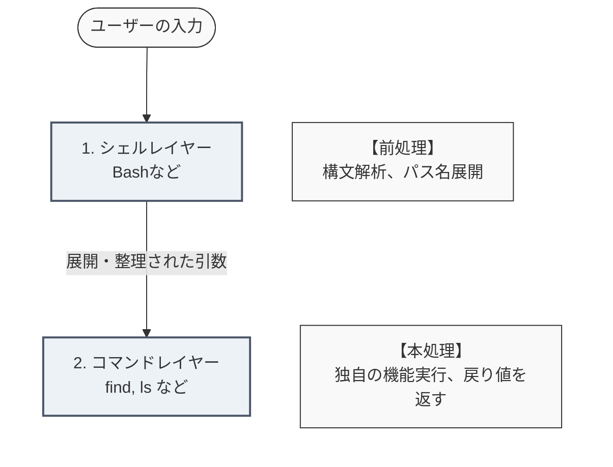

## はじめに

こんにちは。
プログラミング初心者wakinozaと申します。
勉強中に調べたことを記事にまとめています。

十分気をつけて執筆していますが、なにぶん初心者が書いた記事なので、理解が浅い点などあるかと思います。
間違い等あれば、指摘いただけると助かります。

記事を参考にされる方は、初心者の記事であることを念頭において、お読みいただけると幸いです。


## 記事のテーマ

- 現在、LinuCレベル1取得を目指して勉強しています。
- 「*」や「?」のようなワイルドカードを、なぜコマンドによっては引用符で囲む必要があるのだろう？と疑問に思ったので、その仕組みを調べてみました。
-  本記事では、主に Bash 系シェルの挙動を前提に説明します。

## 1\. なぜ `find` コマンドでは引用符が必要なのか？

Linuxのシェル（Bashなど）では、「*」や「?」のように特別な意味を持つ文字をワイルドカードと呼びます。
これらはファイル名や文字列の一部をパターン化し、複数のファイルをまとめて指定する役割を持ちます。

ワイルドカードは、コマンド操作などで利用できますが、コマンドによって記載方法が異なります。
例えば、`ls`コマンドなどはワイルドカードをそのまま記載できるのに対し、`find`コマンドなどでは、ワイルドカードを含む検索式を引用符(「"」や「'」)で囲む必要があります。

```Bash
ls *.txt

find . -name "*.txt"
```

引用符が必要なコマンドとそうでないコマンドの違いは何なのだろう？
そう思って調べてみると、「シェルとコマンドの役割分担」と「UNIX哲学」に由来する合理的な設計が見えてきました。

## 2\. Linuxを形作る「2つのレイヤー」

Linuxにおいて、ユーザーが入力したコマンドが実行されるまでには2つの異なる処理の段階があります。
本記事では、シェルによる引数の前処理と、外部プロセスの実行という関係性を分かりやすくするため、あえてシェルが行う前処理部分を「シェルレイヤー」、実際のコマンド本体を「コマンドレイヤー」と呼びます。

- シェル（前処理担当）：  ユーザーが入力したコマンドを解釈し、OS上でプログラムを実行するためのインターフェース。コマンドで入力された文字列を解析し、環境変数の置き換えやワイルドカードの解析（パス名展開）といった「コマンドを実行するための環境（引数）を整える前処理」を担います。

- コマンド（本処理担当）：   特定の機能（削除、表示、検索など）に特化した、独立したプログラム。プログラミング言語でいう、関数のイメージに近い。シェルレイヤーが整えてくれた「引数」を受け取り、ロジックを実行し、処理結果を標準出力へ出力し、終了ステータスを返します。

ユーザーがコマンドを入力すると、まずシェル（前処理担当）が解析します。
シェルは、ワイルドカードを見つけると、コマンドレイヤーに渡される前に、その場でファイル名の一覧へと書き換えます。例えば「*.txt」という検索式を、「a.txt b.txt c.txt」という具体的なファイル名の羅列に変換しています。
こうして整えられた引数が、コマンド（本処理担当）へとバケツリレーのように引き渡されます。



:::message
より厳密には、シェルはコマンド実行前に前処理を行い、その後 `fork` によって子プロセスを生成し、子プロセス側で `exec` により対象コマンドへ置き換えています。
:::

## 3\. ガードレールとしての引用符

前述したとおり、シェルのワイルドカードの解析（パス名展開）は、コマンドを実行する瞬間に、文字列中のワイルドカードを解析し、指定したパスに実在するファイル名へと置換する仕組みです。
`ls`や`rm`などの多くのコマンドは、シェルが展開した結果のファイルリストをそのまま引数として受け取る設計になっています。この場合は、引用符は不要です。

一方、`find`コマンドは、探索中にファイル名へパターンマッチを行う仕組みを持っています。
これはシェルのパス名展開（glob展開）とは別の処理です。

しかし、`find`コマンドも実行時には、シェルレイヤーの処理を通過しています。
コマンドレイヤーに送られるまでに、本来不要であるシェルレイヤーのパス名展開が実行されてしまうと、エラーとなってしまう場合があります。

:::message
マッチするものが1つもない場合では、期待通りに動作するケースもあります。しかし、マッチするものが一つの場合は、エラーなく、想定とは違う挙動でコマンドが終了してしまう場合もあります。また、複数ファイルに展開されると、`find`が想定している「-name の直後には1つの検索パターンが来る」という引数構造が崩れ、エラーになることがあります。
さらに、展開結果が大量になると、シェルが生成した引数列がOSの制限（ARG_MAX）を超え、コマンドを実行しようとした段階でカーネル側から 「Argument list too long」（容量超過エラー）を突きつけられる場合もあります。
:::

そこで登場するのが、「引用符」です。
引用符（「"」「'」）には、シェルによるパス名展開は不要であることを示す役割があります。
シェルレイヤーでの解析を望まない検索式は、引用符で囲むことで、シェルによるパス名展開を抑制したままコマンドレイヤーに届けられます。

例えば、`find`コマンドで「.txt」という拡張子のファイルをカレントディレクトリから再帰的に検索したいとします。「*.txt」という検索式をシェルレイヤーで解析されないために、検索式は引用符に囲んで、シェルレイヤーのパス名展開を抑制する必要があります。そのため、コマンド文は`find . -name "*.txt"`となります。

これで冒頭の疑問が解けました。

「なぜ `ls *.txt` は良くて `find -name *.txt` はダメなのか？」

その理由は、`find`コマンドが「探索中に見つけたファイル名」とパターン（`*.txt`）を比較する仕組みを持っているためでした。
そのため、シェルによって事前にパス名展開されないよう、引用符で囲む必要があるのです。


## 4\. 引用符の種類

前の章では、「"」も「'」もまとめて引用符として紹介しましたが、引用符にも役割の違いがあります。
この章では、「'」（シングルクォーテーション）、「"」（ダブルクォーテーション）、「\`」（バッククォーテーション）の違いについて説明していきます。

### 4.1\.「'」（シングルクォーテーション）

「'」で囲まれた文字列は、シェルレイヤーにおいて、ただの「文字列」として扱われます。
内部に、ワイルドカード・環境変数があっても、シェルレイヤーにおいてはすべて無視されます。

```Bash
# 変数の定義
CMD=date

# 引用符なしのコマンド実行
echo $CMD
# 結果
date

# 「'」で囲んだ場合のコマンド実行
echo '$CMD'
# 結果
$CMD
```

### 4.2\.「"」（ダブルクォーテーション）

「"」で囲まれた文字列は、シェルレイヤーにおいて、パス名展開（* など）は無効になりますが、変数展開やコマンド置換（後述）は有効です。もし、「"」内で環境変数を表す「$」を文字列として利用したい場合は、その直前にエスケープ文字（「\」バックスラッシュ）を記載します。


```Bash
CMD=date

# 「"」で囲んだ場合のコマンド実行
echo "$CMD"
# 結果
date

echo "\$CMD"
# 結果
$CMD
```

### 4.3\.「\`」（バッククォーテーション）

「\`」で囲まれた文字列内にコマンド文がある場合は、先に内側のコマンド文を実行してから、全体のコマンド文を実行します。

全体のコマンド文は、先に実行された内側のコマンドの実行結果で置き換えられて（コマンド置換）から、実行されます。
内側のコマンドの実行結果を、コマンド全体の引数として使いたいときに利用します。
これは、数学の計算式において括弧 ( ) 内の計算を優先する挙動と似ています。

「\`」は便利ですが、他の引用符と紛らわしかったり、ネスト構造の視認性が低いという欠点があります。
そのため、現在は、「\`」ではなく「$( )」という記法を使うのが主流となっています。

```Bash
CMD=date

# 「`」で囲んだ場合のコマンド実行
echo `$CMD`
# 結果
# 変数 `CMD` に格納された `date` コマンドをコマンド置換したうえで、`echo`コマンドを実行しています。
2026年 5月 28日 木曜日 12:34:56 JST

echo $($CMD)
# 結果
2026年 5月 28日 木曜日 12:34:56 JST
```
## 5\. 引用符を使うコマンド例

パス名展開以外にも、シェルによる「変数展開」や「空白文字による引数の分割」を抑制するために、引用符が必須となるコマンドが存在します。

### 5.1\. `awk`

`awk`コマンドは、テキストデータを処理するコマンドです。指定したパターンに一致する行を抽出したり、データを列ごとに分解して計算や加工を行うことができます。

`awk`コマンドでは、検索条件や、処理内容を「'」(シングルクォーテーション)で囲みます。
例えば、ログデータから2列目（$2）を出力（print）する場合は、以下のコマンドを実行します

```Bash
awk '{print $2}' access.log
```

`$2` は awk のフィールド参照を表す独自構文です。この部分をシェルが解析するとシェル側の変数展開として解釈される可能性があります。
シェルの解析を抑制し、コマンドにそのまま文字列を届けるために、「'」(シングルクォーテーション)が利用されています。

### 5.2\. `sed`

`awk`のほかに`sed`コマンドも、コマンド独自の構文を利用しているため、「'」(シングルクォーテーション)を利用して、シェルの解析を抑制しています。
以下は、fruit.txtファイル中の文字列「apple」をすべて「orange」に置換するコマンド文です。

```Bash
sed 's/apple/orange/g' fruit.txt
```

`s/apple/orange/g` は`sed`コマンド独自の置換構文です。シェルの解析を抑制するため、「'」(シングルクォーテーション)が利用されています。

### 5.3\. `grep`

`grep`コマンドは、ファイルや標準入力から指定した文字列や正規表現に一致する行を検索し、抽出するコマンドです。

```Bash
grep "a*b" log.txt
```

検索文字列に正規表現や拡張正規表現を利用する場合、シェルが構文を解析すると、想定とは違う挙動になる場合があります。そのため、検索文字列は、引用符で囲みます。
正規表現や拡張正規表現を含まない検索文字列は、引用符なしでもエラーにはなりません。しかし、検索文字列に空白が含まれる場合は引数が分割されてしまうため引用符が必須となりますし、「今回は普通の文字だから囲まない」「今回は正規表現だから囲む」と毎回判断していると引用符漏れが起きやすくなります。そのため、正規表現や拡張正規表現を含まない検索文字列も引用符で囲むことが一般的です。


また、`grep`コマンドでは、検索対象ファイルの指定にワイルドカードを利用できます。

```Bash
grep "a*b" *.txt
```

これは、`grep`コマンド自身がパス名展開しているわけではありません。
「*.txt」は、コマンド実行前にシェルによってパス名展開され、実在するファイル一覧へと変換されています。

例えば、カレントディレクトリに a.txt b.txt が存在する場合、シェルレイヤーで以下のように展開されます。

```Bash
grep "a*b" a.txt b.txt
```

その後、展開済みのファイル一覧が `grep`コマンドへ引き渡されます。

このように、検索対象ファイルの指定については、シェルのパス名展開の仕組みと`grep`コマンドの期待する引数形式が一致しています。
そのため、「*.txt」のようなファイル指定には通常引用符を利用しません。

一方で、検索パターン側（"a*b" など）は`grep`コマンド独自の正規表現構文として扱いたいため、シェルによる解釈を抑制する引用符を利用します。

`grep`コマンドは、引用符で囲むものと囲まないものが混在するため、コマンドを実行する際には記載に気を付ける必要があります。

## 6\. Linuxの設計思想

ここまで読んでくださった中には、そもそも「なぜコマンド処理の前に、わざわざシェルが処理を行うのか」と疑問に思う人もいるかもしれません。
確かに、シェルの前処理が存在しない設計であれば、「このコマンドでは引用符で囲むべきか、囲まないべきか」といちいち頭を悩ませる必要もなくなります。

しかし、Linux（UNIX）は、時にエラーや混乱のリスクを冒してまで、あえて「シェルがコマンドの前に割り込んで前処理をする」仕組みを導入しています。
その理由は、「UNIX哲学」と「コマンド操作体系の統一」にあります。

UNIX哲学には様々な形式や解釈がありますが、最も有名な言葉に、パイプ（|）の生みの親であるダグラス・マキロイらが遺した「1つのプログラムには、1つのことをうまくやらせろ（Do one thing and do it well）」というものがあります。
プログラムに無理に新しい機能を追加して肥大化させるよりも、機能は極限までシンプルに保ち、それらを「組み合わせる（繋ぐ）」ことで複雑な処理を実現しよう、という思想です。

もし、シェルがワイルドカードの解析（前処理）を行わないとしたらどうなるでしょうか。
Linuxに存在する何百、何千というすべてのコマンドの内部に、開発者がそれぞれ独自に「ワイルドカードを解析して、ディレクトリをスキャンして、該当するファイルを探し出すロジック」を自前で実装しなければならなくなります。これではコマンドが肥大化してしまいます。
ワイルドカードの解析という「共通の処理」をシェルという窓口に一括で任せ、綺麗に整えられた引数だけをコマンドに引き渡すことで、個々のコマンドをシンプルに保つことが可能になります。

さらに、この設計は「ユーザー側の使いやすさ」にも直結しています。
もし各コマンドが独自に解析ロジックを実装してしまえば、「コマンドAとコマンドBでアスタリスク（*）の挙動やルールが微妙に違う」といった混乱が起きていたでしょう。私たちがどのコマンドを使うときも、全く同じルールでワイルドカードを利用できるのは、シェルという単一のレイヤーがその処理を一括で請け負っているからこそ実現できている恩恵なのです。

この前処理の共通化は合理的な設計ですが、一方で、ファイル名にスペースが含まれている場合などに意図しないバグやセキュリティリスク（意図しないファイル展開）を生む原因にもなります。だからこそ、「迷ったら引用符で囲む」というガードレールを常に意識する必要があります。


## まとめ

本記事では、Linux操作において疑問に思った「引用符（クォーテーション）の有無」について、シェルレイヤーとコマンドレイヤーの役割分担という視点から解説しました。

- lsなどの単一ディレクトリ操作：シェルのパス名展開に任せる

- findやawk/sed/grepなど、コマンド自身がパターンや独自構文を解釈する場合 : シェルによる展開を防ぐために引用符を利用する

---------------

記事は以上です。
最後までお読みいただき、ありがとうございました。

## 参考情報一覧

この記事は以下の情報を参考にして執筆しました。

- Linux教科書 LinuCレベル1Version 10.0対応
- 新しいLinuxの教科書 第2版
- [ping-t](https://mondai.ping-t.com/)
- [awkコマンドの基本](https://qiita.com/zatoshi/items/563af1b485ff413d381f) (最終更新 2016-03-14) (参照 2026-05-28)
- [manページ  — SCP](https://nxmnpg.lemoda.net/ja/1/scp) (参照 2026-05-28)
- [Linux grepコマンドの使い方](https://qiita.com/LIB/items/6950acebedd576780ced) (最終更新 2021-01-03) (参照 2026-05-28)
- [Unix哲学「一つのことをうまくやる」は単機能のコマンドを作ることではない](https://qiita.com/ko1nksm/items/4e84622b1dccd1bb3180) (最終更新 2024-05-20) (参照 2026-05-28)