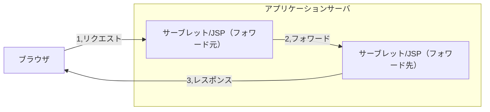
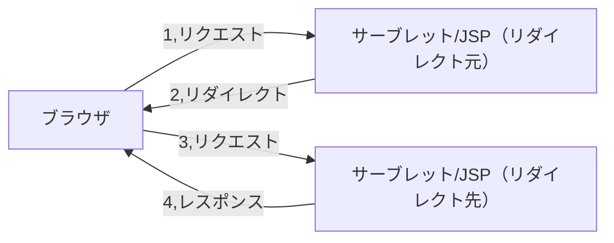
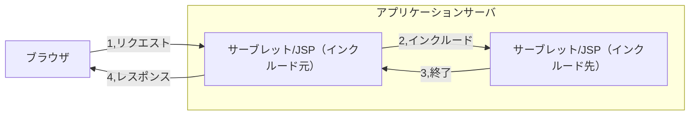

## はじめに

こんにちは。
プログラミング初心者wakinozaと申します。
Java勉強中に調べたことを記事にまとめています。

十分気をつけて執筆していますが、なにぶん初心者が書いた記事なので、理解が浅い点などあるかと思います。
間違い等あれば、指摘いただけると助かります。

記事を参考にされる方は、初心者の記事であることを念頭において、お読みいただけると幸いです。


## 対象読者

- Javaを勉強中の方
- Servlet/JSPについて知りたい方


## 動作環境

- MacBook（Intel CPU 搭載）
- Oracle Java 21
- eclipse 2023
- Tomcat 10

## 記事のテーマ

- 現在、Javaのサーバサイドの技術であるServlet/JSPについて勉強しています。
- 備忘録として勉強したことをまとめています。

## 目次

1\. Servlet/JSPとは
2\. フォワード
3\. リダイレクト
4\. インクルード

## 本文

### 1\. Servlet/JSPとは

この節ではまず、前提知識として、Webページの閲覧の仕組み、静的なページと動的なページ、サーブレットとJSPについて説明していきます。

#### 1.1\. Webページの閲覧の仕組み

インターネットを通じてWebページを閲覧する際は、「ブラウザ」と「Webサーバ」というソフトウェアが動いています。

ブラウザは、Webページの情報を取得し、画面に表示するソフトウェアです。ブラウザの例としては、Chrome、Safari、Edgeなどがあります。

一方のWebサーバは、Webページのデータを管理しており、ブラウザから要求を受けるとネットワークを通じてデータを提供します。Webサーバの例としては、Apache、Nginx、IISなどの製品があります。

私たちがWebページを閲覧しようとブラウザを操作すると、ブラウザはネットワークを通じてWebサーバにWebページのデータを要求します。この要求のことを「リクエスト」と呼びます。
Webサーバはリクエストを受け取ると要求されたデータをネットワークを通じてブラウザに送信します。この応答のことを「レスポンス」と呼びます。

リクエストとレスポンスは、HTTP（Hyper Text Transfer Protocol）という通信プロトコルに基づいています。通信プロトコルとは、ネットワーク上で通信を成立させるための共通の取り決めのことです。

この通信プロトコルは、例えるなら交通ルールのようなものです。もし交通ルールがなく、車が自由に走行して良いとなれば、すぐに大渋滞や事故が起き、誰も安全に車を運転できなくなるでしょう。車線は左、信号を守るといったルールを皆が順守するからこそ、事故や渋滞を極力避け、安全に車を利用することができます。

これと同様に、複数のコンピューターやソフトウェアが共通の通信プロトコルを使用することで、互いの間でスムーズかつ確実に情報交換を行うことができるのです。

#### 1.2\. 静的なWebページと動的なWebページ

Webページは、レスポンスとして返すHTMLの生成方法により、「静的なWebページ」と「動的なWebページ」の2つに分類することができます。

「静的なページ」とは、ユーザーの違いやユーザーの操作によって内容が変化しないページのことです。例えば、ニュースサイトに掲載された記事のページや、会社の紹介ページなどは静的なWebページです。
静的なWebページでは、WebサーバにはWebページのデータとしてHTMLファイルが配置されています。ブラウザがWebページをリクエストすると、Webサーバは配置されているHTMLファイルを、そのままレスポンスとしてブラウザに返します。HTMLファイルの内容は固定であるため、同じWebページをリクエストすると、常に同じ内容が表示されるのです。

一方、動的なWebページとは、ユーザーの操作によって内容が変化するページのことです。例えば、検索サイトが表示する検索結果のページやショッピングサイトのカートのページなどは動的Webページです。
ユーザーの操作に対応する全ての静的なWebページをあらかじめ作成しておくのは、無数のパターンが存在するため、現実的ではありません。そのため、動的なWebページでは、ユーザーの操作に応じて、その場で新しいWebページを生成する仕組みが用意されています。

この仕組みの実現には、サーバサイドで処理を実行するプログラムが必要です。
まず、リクエストを受け取ったWebサーバが、サーバサイドに設置されたプログラムを実行します。
この次に、サーバサイドプログラムが、リクエストに含まれるデータを受け取り、HTMLファイルをその場で生成します。
最後に、Webサーバが、生成されたHTMLファイルを、レスポンスとしてブラウザに返します。

このように、動的なWebページを生成する仕組みを「Webアプリケーション」と呼びます。

#### 1.3\. ServletとJSP

動的なWebページを生成するには、Webサーバの他に、Webコンテナと呼ばれるソフトウェアが必要です。
Webサーバは、リクエストを受け付けて静的なページのデータを返すことができますが、動的なページを作成することはできません。
そのため、サーブレットの実行環境を提供し、動的なページのデータを生成するためのWebコンテナが必要となるのです。

Webサーバの機能とWebコンテナの機能を両方備えたソフトウェアを、「アプリケーションサーバ」と呼びます。

Java言語において、アプリケーションサーバで処理を実行する仕組みが、「サーブレット」と「JSP(Jakarta Server Pages)」です。

サーブレットとJSPは、「Jakarta EE」という仕様に従ってプログラムを記述します。
Jakarta EEは、主にサーバサイドプログラムを記述するための機能を提供する仕様です。

WebコンテナがJSPを実行すると、JSPファイルからサーブレットのプログラムを生成し、それをコンパイルしてサーブレットとして実行します。つまり、サーブレットとJSPはどちらも最終的にはサーブレットとなり、同様の働きを行うのです。
このようにサーブレットとJSPファイルは同様の働きをするにもかかわらず、2種類の技術が用意されているのはなぜなのでしょう。
その理由は、プログラムの記述方法にあります。

サーブレットは、Javaプログラムの中にHTMLが埋め込まれたような構造になっています。
一方のJSPは、HTMLの中にJavaプログラムが埋め込まれたような構造になっています。
そのため、Java言語が主体でHTMLのコードが少ないクラスはサーブレットが向いていて、HTMLが主体でJava言語による処理が少ないクラスはJSPが向いていると言えます。具体的には、複雑な処理はサーブレットに任せ、出力処理をJSPファイルに任せることができます。

JavaかHTMLのどちらが主体になるかによって、サーブレットとJSPを使い分けるのが一般的です。

### 2\. フォワード

以後の節では、サーブレットやJSPファイルから、他のサーブレットやJSPファイルに、画面遷移を行う方法を説明します。ここでいう画面遷移とは、サーブレットのAPIを使ってWebページを切り替えることを指します。画面遷移の方法としては、「フォワード」「インクルード」「リダイレクト」があります。

#### 2.1\. フォワードとは

「フォワード」とは、あるサーブレットやJSPから、他のサーブレットやJSPに処理を移行する機能です。

よく利用されているのは、サーブレットからJSPへのフォワードです。
サーブレットからJSPファイルにフォワードすることで、出力処理をするJSPファイル任せることができるのです。



#### 2.2\. フォワードのメソッド

フォワードを行うには、2つの操作が必要です。
まず1つ目は、jakarta.servlet.http.HttpServletRequestインターフェースのgetRequestDispatcher()メソッドで、フォワード先を指定します。

| メソッド | 説明 |
| ---- | ---- |
| RequestDispatcher getRequestDispatcher(String path) | 引数で指定したパスへ遷移するRequestDispatcherインスタンスを取得します |

フォワード先の指定方法は、以下の通りです。

- サーブレットクラスの場合：サーブレットのURLパターン
- JSPファイルの場合： Webappディレクトリからのパス

２つ目は、jakarta.servlet.RequestDispatcherインターフェースのforward()メソッドを利用します。

| メソッド | 説明 |
| ---- | ---- |
| void forward(ServletRequest request, ServletResponse response) | フォワードを実行する |

フォワードのコード例は、以下の通りです。

```Java
//フォワード先を指定し、RequestDispatcherインスタンスを取得する
RequestDispatcher dispatcher = request.getRequestDispatcher("example.jsp"); 
//フォワードを実行する
dispatcher.forward(request, response);
```

上の２つの文を１つにまとめると、以下の通りです。

```Java
request.getRequestDispatcher("example.jsp").forward(request, response);
```

#### 2.3\. フォワードの注意点

フォワード先は、サーブレットクラスとJSPファイルどちらも指定することができますが、同じWebアプリケーション内に限られます。

また、転送後のアドレスバーに表示されるURLは、リクエスト時のままになります。
そのため、フォワードを使うとURLと画面の表示内容にずれが生じる場合があります。このようなズレは、不具合の原因となる場合もあるため、避ける必要があります。

また、フォワードでは、同じリクエスト/レスポンスの往復内で処理が完結する。そのため、リクエストスコープという、リクエストを受け取ってからレスポンスを返すまでの間だけデータを保持できる仕組みも利用できます。

### 3\. リダイレクト

#### 3.1\. リダイレクトとは

リダイレクトは、サーブレットやJSPがレスポンスを出力する代わりに、指定したWebページをブラウザに開かせる仕組みです。
ユーザーから見ると、サーブレット/JSPのURLを開いたにもかかわらず、別のURLを開いたように見えます。

リダイレクトは、Webサーバやアプリケーションサーバがブラウザに特別なステータスコードを返すことによって実現します。
HTTPには、リダイレクトを表すステータスコードがいくつか用意されています。
リダイレクトで使用される主なステータスコードは302(Found)です。場合に応じて、303(See Other)や307(Temporary Redirect)が利用されることもあります。

リダイレクト機能を使用すると、 ブラウザにリダイレクトを表すステータスコード(302)とリダイレクト先のURLが返されます。
ステータスコードを受け取ったブラウザは、リダイレクト先として指定されたURLを開きます。

具体的な手順は、以下の通りです。
1、ブラウザが リクエストを送信すると、リダイレクト元のサーブレット/JSPが実行されます
2、リダイレクトを行うと、リダイレクト先のURLがブラウザに送信されます
3、ブラウザはリダイレクト先にリクエストを送信します
4、リダイレクト先はブラウザにレスポンスを返します



フォワードはリクエスト/レスポンスが1往復なのに対し、リダイレクトは2往復していることがわかります。

#### 3.2\. リダイレクトのメソッド

リダイレクトを行うには、jakarta.servlet.http.HttpServletResponseインターフェースのsendRedirect()メソッドを利用します。

| メソッド | 説明 |
| ---- | ---- |
| void sendRedirect(String location) | 引数で指定されたURLにリダイレクトします |

リダイレクト先の指定は、同じアプリケーション内の場合は以下を記入します。

- サーブレットクラスの場合：サーブレットのURLパターン
- JSPファイルの場合： Webappディレクトリからのパス

リダイレクトは、アプリケーション外の別のアプリや別のサイトなどのURLを指定することも可能です。

リダイレクトのコード例は、以下の通りです。

```Java
response.sendRedirect("http://localhost:8000/example/ExampleServlet"); 
```

#### 3.3\. リダイレクトの注意点

フォワード先は同じWebアプリケーション内に限られましたが、リダイレクトは別のアプリケーションや別のページのURLも指定することができます。
そのため、外部のアプリケーションや外部ページに遷移したい場合は、リダイレクトを用います。

フォワードは、フォワード後もリクエスト元のURLが表示されていました。しかし、リダイレクトではリダイレクト先のURLに変わっているため、URLと画面のずれが起こることはありません。
フォワードを使うと、URLと画面がずれてしまうような状況では、リダイレクトを使用すると良いでしょう。

また、リダイレクトでは、リダイレクト時にリクエストが新しくなってしまうため、リクエストスコープは利用できません。セッションスコープやアプリケーションスコープは利用可能です。

### 4\. インクルード

#### 4.1\. インクルードとは

インクルードは、フォワードと同じく、サーブレット/JSPから他のサーブレット/JSPを呼び出す機能です。

フォワードとの違いは2点です。
1、呼び出されたサーブレット/JSPの処理が終わると、呼び出し元のサーブレット/JSPに処理が戻る
2、インクルードする側のサーブレット/JSPがレスポンスを出力する

具体的な手順を見ると、以下の通りです。

1、ブラウザがリクエストを送信すると、インクルード元のサーブレット/JSPが実行されます
2、インクルードを実行すると、インクルード先サーブレット/JSPが実行されます
3、インクルード先の処理が終了すると、インクルード元のサーブレット/JSPに処理が戻ります。
4、処理が終わったインクルード元のサーブレットは、ブラウザにレスポンスを返します。



インクルードは、複数のサーブレット/JSPファイルを組み合わせて、レスポンスを出力する場合によく用いられます。インクルード後はインクルード元に処理が戻るので、複数のファイルの出力をどのように組み合わせるかを、インクルード元で制御することができます。
具体的には、ヘッダーやフッターなど複数のページの共通する部分を1つのファイルにまとめて、使い回す場合に利用されます。共通部分を１つのファイルにまとめることによって、変更を容易にし、保守性を高めることができます。

#### 4.2\. インクルードのメソッド

インクルード先の指定は、フォワードと同じく、RequestDispatcherインターフェースのgetRequestDispatcher()メソッドを利用します。

インクルードの実行には、RequestDispatcherインターフェースのinclude()メソッドを利用します。

| メソッド | 説明 |
| ---- | ---- |
| void include(ServletRequest request, ServletResponse response) | インクルードを実行する |

インクルードのコード例は、以下の通りです。

```Java
//インクルード先を指定し、RequestDispatcherインスタンスを取得する
RequestDispatcher dispatcher = request.getRequestDispatcher("header.jsp"); 
//インクルードを実行する
dispatcher.include(request, response);
```

上の２つの文を１つにまとめると、以下の通りです。

```Java
request.getRequestDispatcher("header.jsp").include(request, response);
```


#### 4.3\. インクルードの注意点

インクルードの注意点は、フォワードと同様です。

インクルード先は、サーブレットクラスもJSPファイルもどちらも指定することができますが、同じWebアプリケーション内に限られます。

また、転送後のアドレスバーに表示されるURLは、リクエスト時のままです。

同じリクエスト/レスポンスの往復内で処理が完結するため、リクエストスコープも利用できます。


## まとめ

- Servlet/JSP は、Java言語で動的なWebページを生成するための技術であり、Webサーバと連携するWebコンテナ上で動作します。JSPは最終的にサーブレットに変換・実行されます

- フォワードは、アプリケーションサーバ内部で処理を他のサーブレット/JSPに移行させる機能です。リクエストスコープの情報を引き継げますが、ブラウザのURLは変わりません

- リダイレクトは、ブラウザに新しいURLへの再リクエストを促す仕組みです。URLが変更されるため、画面とのズレは起こりませんが、リクエストスコープの情報は失われます

- インクルードは、他のサーブレット/JSPの処理を呼び出し、処理終了後に呼び出し元に戻る機能です。主に複数のファイルの情報を統合するのに利用され、リクエストスコープの情報は引き継がれます

---------------

記事は以上です。
最後までお読みいただき、ありがとうございました。

##  参考情報一覧

この記事は以下の情報を参考にして執筆しました。

- [スッキリわかるサーブレット&JSP入門 第4版]
- [基礎からのサーブレット/JSP 第5版]
- [JSP & Servlet 入門](https://qiita.com/Kazunori-Kimura/items/a15a011485ac92074d6f) (最終更新 2018-01-09) (参照 2025-10-8)
