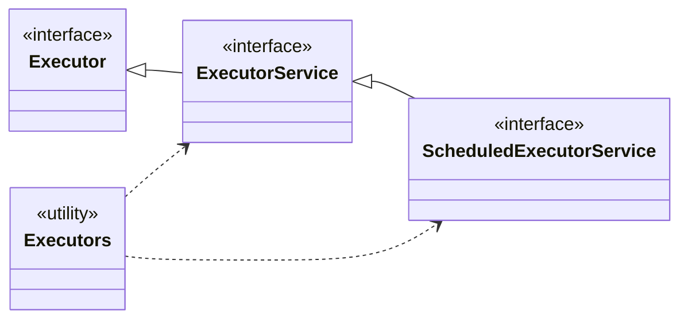

## はじめに

こんにちは。
プログラミング初心者wakinozaと申します。
Java勉強中に調べたことを記事にまとめています。

十分気をつけて執筆していますが、なにぶん初心者が書いた記事なので、理解が浅い点などあるかと思います。
間違い等あれば、指摘いただけると助かります。

記事を参考にされる方は、初心者の記事であることを念頭において、お読みいただけると幸いです。


## 対象読者

- Javaを勉強中の方
- Java SE11 Gold試験を勉強中の方
- JavaのExecutorフレームワークの概要と主要APIついて知りたい方

## 目次

1\.スレッドプール
2\.ExecutorServiceを作成するファクトリメソッド
3\.ExecutorServiceインターフェースのAPI
4\.ScheduledExecutorServiceを作成するファクトリメソッド
5\.ScheduledExecutorServiceインターフェースのAPI


この記事では、JavaのExecutorフレームワークについて解説していきます。
Javaのマルチスレッド、Threadクラス、Runnableインターフェースについて知りたい方は、前回の記事をご覧ください。

https://zenn.dev/wakinoza/articles/a12e8b1e1d5286

## 本文

### 1\. スレッドプール

マルチスレッドによる並行・並列処理は非常に強力ですが、使い方を間違えると逆にパフォーマンスを下げる可能性があります。特に新しいスレッドの作成は、コンピュータにとって負荷の高い処理であるため、無駄なスレッドを大量に作成すると、パフォーマンスの低下につながります。

そこで、スレッドの無駄遣いを防ぐため、あらかじめ生成しておいたスレッドを使い回す仕組みが導入されました。それが、「スレッドプール」です。

「スレッドプール」は、複数個の空のスレッドを準備しておき、それぞれのスレッドに処理を与えて実行させます。処理が終わったスレッドはプールに戻り、次のタスクを待ちます。

このように、処理が終わったスレッドを再利用することで、処理が終わったスレッドがあるにも関わらず新しいスレッドを作ってしまう「スレッドの無駄遣い」を防ぐことができるのです。

「Executorフレームワーク」は、「スレッドプール」を用いて効率的なマルチスレッド処理を実現するための一連のインターフェースとクラス群です。
java.util.concurrent.Executorをスーパーインターフェースとした複数のインターフェースで構成されています。



具体的な利用方法は、Executorインターフェースのサブインターフェースであるjava.util.concurrent.ExecutorServiceや、java.util.concurrent.ScheduledExecutorServiceを利用します。
これら２つのサブインターフェースの実装を取得するには、java.util.concurrent.Executorsクラスを利用します。Executorsクラスは、ExecutorServiceインターフェースやScheduledExecutorServiceインターフェースを実装したインスタンスへの参照を返すファクトリメソッドを用意しています。

### 2\. ExecutorServiceを作成するファクトリメソッド

次に、ExecutorServiceインターフェースの利用方法について説明します。

ExecutorServiceを実装したインスタンスは、ユーティリティクラスであるExecutorsクラスのファクトリメソッドを利用して取得します。まずは、Executorsクラスの代表的なファクトリメソッドを３つ説明していきます。

#### 1\. newSingleThreadExecutorメソッド

public static ExecutorService newSingleThreadExecutor()

- mainメソッドとは別のタスクを持つ新しいスレッドを１つだけ作ってプールしているExecutorServiceを作成します
- スレッドプールにはスレッドが１つしかないため、複数回の処理を実行する場合は、１つのスレッドを使い回します。そのため、処理が順番に実行されることが保証されます

```Java
ExecutorService executor1 = Executors.newSingleThreadExecutor();
executor1.submit(() - > {
    System.out.println("SingleThreadExecutor");
})
```

#### 2\. newFixedThreadPoolメソッド

public static ExecutorService newFixedThreadPool(int nThreads)

- 引数で指定された個数のスレッドを持つ固定長のプールを作り、そのスレッドを処理に割り当てるためのExecutorServiceを作成します
- すべてのスレッドが実行中の場合、後から送信された処理はキューで待機します。実行を終えたスレッドが出ると、キューで待機していた処理がそのスレッドに割り当てられます

```Java
ExecutorService executor2 = Executors.newFixedThreadPool(3);
executor2.submit(() - > {
    System.out.println("newFixedThreadPool");
})
```

#### 3\. newCachedThreadPoolメソッド

public static ExecutorService newCachedThreadPool()

- 必要に応じてスレッドを増減させるスレッドプールを作り、そのスレッドを処理に割り当てるためのExecutorServiceを返します。必要に応じて追加のスレッドを生成できるため、追加の処理に柔軟に対応できます。１度生成されたスレッドは、処理完了後60秒未満であれば再利用されますが、60秒間使用されなければ自動的に廃棄されます

```Java
ExecutorService executor3 = Executors.newCachedThreadPool();
executor3.submit(() - > {
    System.out.println("newCachedThreadPool");
})
```

### 3\. ExecutorServiceインターフェースのAPI

ExecutorServiceは、インターフェースを実装したインスタンスへの参照を、Executorsクラスのファクトリメソッドから取得しました。
取得したExecutorServiceで処理を行う場合は、ExecutorServiceインターフェースのAPIを利用します。
この節では、ExecutorServiceインターフェースの代表的なAPIを説明します。

特に重要なのは、スレッドプールのシャットダウンを行うメソッドです。
スレッドプールは、シャットダウンで明示的に終了させない限り、プログラムの終了後もバックグラウンドで生き続けます。その結果、リソースリークを引き起こしたり、メインスレッドが終了してもJVMやプログラムが想定通りに終了しなかったりという事態が生じます。

スレッドプールを利用し終わった後は、必ずシャットダウンのメソッド(shutdown()など)を呼び出しましょう。

#### 1\. submitメソッド

- ExecutorServiceに処理を送信して、処理結果のFutureを返します
- 3つのオーバーロードがあります

Future<?> submit(Runnable task)

- 引数にRunnableの処理を受け取り、ExecutorServiceに処理を送信して、処理結果のFutureを返します
- Futureのgetメソッドは、正常に完了した時点でnullを返します。このFutureオブジェクトを使うことで、タスクの完了を待機したり、タスク実行中に発生した例外を検知したりが可能です

<T> Future<T> submit(Runnable task, T result)

- 引数にRunnableの処理を受け取り、ExecutorServiceに処理を送信して、処理結果のFutureを返します
- Futureのgetメソッドは、正常に完了した時点で第2引数で指定された結果を返します。

<T> Future<T> submit(Callable<T> task)

- 引数に Callableの処理を受け取り、ExecutorServiceに処理を送信して、処理結果のFutureを返します

FutureクラスとCallableインターフェースについては、別記事で紹介する予定です。

#### 2\. invokeAllメソッド

<T> List<Future<T>> invokeAll(Collection<? extends Callable<T>> tasks)

- 引数で指定された処理を実行し、すべて完了すると、ステータスと結果を含むFutureのリストを返します
- 待機中に割込みが発生した場合はInterruptedExceptionをスローします

#### 3\. shutdownメソッド

void shutdown()

- ExecutorServiceをシャットダウンする。新規処理は受け付けを停止し、実行中の処理をすべて実行し終えた後、すべてのスレッドを正常に終了させます。

#### 4\. shutdownNowメソッド

List<Runnable> shutdownNow()

- ExecutorServiceをシャットダウンする。以後、新規処理は受け付けず、実行中のすべての処理も割り込みをかけて強制的に停止しようと試みます

#### 5\. isShutdownメソッド

boolean isShutdown()

- ExecutorServiceがシャットダウンしていた場合、trueを返します

#### 6\. awaitTerminationメソッド

boolean awaitTermination(long timeout, TimeUnit unit)

- 引数で指定された時間だけ待機し、実行中のすべてのスレッドが終了した場合はtrueを、終了しなかった場合はfalseを返します
- 待機中に割込みが発生した場合はInterruptedExceptionをスローします

:::message
第2引数のTimeUnitは、java.util.concurrent.TimeUnitという時間単位を表す列挙型です。TimeUnitには24時間を表す「DAYS」、1時間を表す「HOURS」、1分を表す「MINUTES」、1秒を表す「SECONDS」などの時間単位を表す列挙子が定義されています。、第１引数の整数と組み合わせることで、待機時間を表現します。
:::

幾つかのメソッドを利用して、ExecutorServiceに処理を送信し、シャットダウンしてみましょう。

```Java
public class ExecutorShutdownExample {
    public static void main(String[] args) {
        ExecutorService executor = Executors.newFixedThreadPool(2);

        // タスクを投入
        for (int i = 0; i < 5; i++) {
            executor.submit(() -> {
                System.out.println("task");
            });
        }

        // シャットダウンの開始
        executor.shutdown();

        try {
            // スレッドプールがすべてのタスクを完了するのを待つ（最大60秒）
            if (!executor.awaitTermination(60, TimeUnit.SECONDS)) {
                // タイムアウトした場合、強制的にシャットダウン
                executor.shutdownNow();
            }

         // awaitTermination中に割り込みが発生した場合
        } catch (InterruptedException e) {
            // 割り込みを要求された場合、強制的にシャットダウン
            executor.shutdownNow();
            //呼び出し元に割り込み要求があったことを伝え、割り込みステータスをtrueにする
            Thread.currentThread().interrupt();
        }
    }
}
```

### 4\.ScheduledExecutorServiceを作成するファクトリメソッド

ExecutorServiceでは、submitで渡された処理はすぐに実行されるため、処理のタイミングを制御することはできません。
処理を実行するタイミングの制御や定期的に処理を実行したい場合は、ScheduledExecutorServiceインターフェースを利用します。

ScheduledExecutorServiceインターフェースも、Executorsクラスを利用して、ScheduledExecutorServiceインターフェースを実装したインスタンスへの参照を取得します。
この節では、Executorsクラスの2つのファクトリメソッドを説明します。

#### 1\. newSingleThreadScheduledExecutorメソッド

public static ScheduledExecutorService newSingleThreadScheduledExecutor()

- mainメソッドとは別のタスクを持つ新しいスレッドを１つだけ作ってプールしているScheduledExecutorServiceを作成します

```Java
//newSingleThreadScheduledExecutorメソッドの利用方法
ScheduledExecutorService executor1 = Executors.newSingleThreadScheduledExecutor();
```

#### 2\. newScheduledThreadPoolメソッド

public static ScheduledExecutorService newScheduledThreadPool(int corePoolSize)

- 引数で指定された個数のスレッドを持つスレッドプールを作り、そのスレッドを処理に割り当てるためのScheduledExecutorServiceを作成します。

```Java
//newScheduledThreadPoolメソッドの利用方法
ScheduledExecutorService executor2 = Executors.newScheduledThreadPool(3);
```

### 5\.ScheduledExecutorServiceインターフェースのAPI

ExecutorServiceと同様、ScheduledExecutorServiceインターフェースを実装したインスタンスへの参照は、Executorsクラスのファクトリメソッドを利用して取得しました。
取得したScheduledExecutorServiceで処理を行う場合は、ScheduledExecutorServiceインターフェースのAPIを利用します。

ScheduledExecutorServiceインターフェースは、ExecutorServiceを継承しているため、ExecutorServiceで宣言されているsubmitメソッド、shutdownメソッドなどはScheduledExecutorServiceでも利用できます。
この節では、ScheduledExecutorServiceで宣言されている代表的なメソッドを説明していきます。

#### 1\. scheduleメソッド

ScheduledFuture<?> schedule(Runnable command, long delay, TimeUnit unit)
<V> ScheduledFuture<V> schedule(Callable<V> callable, long delay, TimeUnit unit)

- 第2引数と第3引数で指定された時間分遅延した上で、第1引数で指定された処理を一回だけ実行します、処理はRunnableもしくはCallableで指定できます

```Java
ScheduledExecutorService executor3 = Executors.newSingleThreadScheduledExecutor();
executor3.schedule(() -> {
    System.out.println("task");
    executor3.shutdown();
}, 2, TimeUnit.SECONDS);
```

#### 2\. scheduleAtFixedRateメソッド

ScheduledFuture<?> scheduleAtFixedRate(Runnable command, long initialDelay, long period, TimeUnit unit)

- 定期的に繰り返し処理を実行したい場合に用います。特に、実行時間にばらつきのある処理を、なるべく指定されたインターバルに収まるように間隔を調整しながら、繰り返し実行するのに適しています
- 第１引数に処理内容、第2引数に最初の遅延時間、第3引数に２回目以降のインターバル時間、第4引数に時間の単位を受け取ります
- 最初の遅延時間が終了し、最初の処理が開始した時刻を基準に、指定されたインターバルを開けて繰り返し処理を実行します。もし、前の処理が終わる前にインターバルが終わっていても、前の処理が終了するまで、次の処理は実行されません。また、前の処理が終わっても、インターバルが終わっていない場合は、インターバルが終わるまで次の処理は待機します。

```Java
ScheduledExecutorService executor3 = Executors.newSingleThreadScheduledExecutor();
executor3.scheduleAtFixedRate(() -> {
    System.out.println("task");
}, 1, 2, TimeUnit.SECONDS);
```

#### 3\.scheduleWithFixedDelayメソッド

ScheduledFuture<?> scheduleWithFixedDelay(Runnable command, long initialDelay, long delay, TimeUnit unit)

- 定期的に繰り返し処理を実行したい場合に用いるメソッドです。前の処理の終了から次の処理開始まで、一定のインターバルを空けて、繰り返し実行します
- 第１引数に処理内容、第2引数に最初の遅延時間、第3引数に２回目以降のインターバル時間、第4引数に時間の単位を受け取ります
- 前の処理にかかった時間に関わらず、「処理の開始時刻」を基準に固定周期で実行する場合はscheduleAtFixedRateメソッドを、「前の処理の終了時刻」を基準にインターバルを開けて次を実行したい場合はscheduleWithFixedDelayメソッドを利用すると良いでしょう

## まとめ

- スレッドプール: スレッドの生成・破棄に伴うコストを削減するため、スレッドをプールして再利用する仕組みです。JavaではExecutorフレームワークを用いて効率的に扱えます

- ExecutorService: スレッドプールを管理し、非同期に処理を実行するためのインターフェースです。Executorsクラスのファクトリメソッド (newFixedThreadPoolなど) を使ってインスタンスを生成します

- ScheduledExecutorService: タスクの遅延実行や周期的な実行をスケジュールするためのインターフェースです。「タスク開始時刻」を基準とするscheduleAtFixedRateと、「前回のタスク終了時刻」を基準とするscheduleWithFixedDelayなどがあります

- シャットダウンの重要性: Executorフレームワークで作成したスレッドプールは、プログラムが終了しても自動的には破棄されません。リソースリークを防ぐため、利用後には必ずshutdown()メソッドなどを呼び出し、明示的に終了させる必要があります

---------------

記事は以上です。

次回は、Futureクラス、Callableインターフェースについてまとめる予定です。

最後までお読みいただき、ありがとうございました。

##  参考情報一覧

この記事は以下の情報を参考にして執筆しました。

- [徹底攻略 Java SE11 Gold 問題集]
- [スッキリわかるJava入門 実践編 第４版]
- [パーフェクトJava 改訂3版]
- [プロになるJava]
- [Java本格入門]
- [3.2 並行処理ユーティリティとExecutorフレームワーク（スレッドプール、ExecutorService、Callable、Futureなど）～Java Advanced編](https://qiita.com/KenyaSaitoh/items/9e049e7fb49b22546c05) (最終更新 2023-11-05) (参照 2025-08-02)
- [公式ドキュメント](https://docs.oracle.com/javase/jp/21/docs/api/java.base/java/util/concurrent/Executor.html) (参照 2025-08-02)