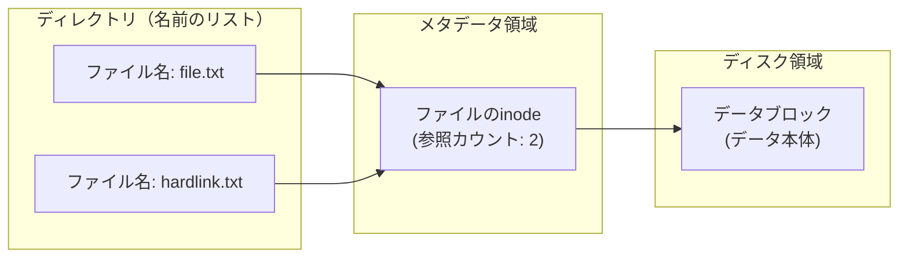
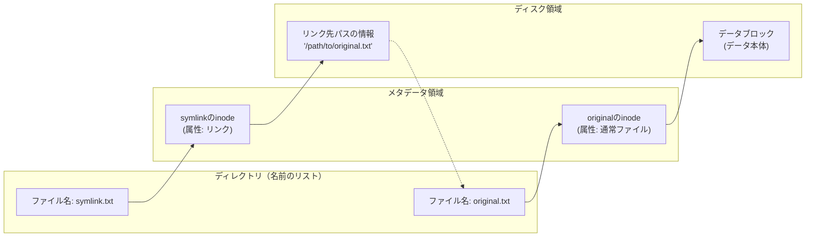

## はじめに

こんにちは。
プログラミング初心者wakinozaと申します。
勉強中に調べたことを記事にまとめています。

十分気をつけて執筆していますが、なにぶん初心者が書いた記事なので、理解が浅い点などあるかと思います。
間違い等あれば、指摘いただけると助かります。

記事を参考にされる方は、初心者の記事であることを念頭において、お読みいただけると幸いです。

## 記事のテーマ

- 現在、LinuCレベル1取得を目指して勉強しています。
- ハードリンクとシンボリックリンクについて、勉強したことをまとめていきます。

## 目次

1\. Linuxのファイル管理
2\. なぜinodeが必要なのか
3\. ハードリンク
4\. シンボリックリンク
5\. ハードリンクとシンボリックリンクの使い分け

## 1\. Linuxのファイル管理

Linuxでファイル操作を行う際に、人間は「ファイル名」を用いてアクセスします。

しかし、Linux内においては、ファイルは「ファイル名（ディレクトリエントリ）」「データ本体（データブロック）」「inode」という3つの要素に分けて管理されています。

「ファイル名」はファイルの名前、「データ本体」はファイルの中身を指します。
では、「inode」が何かというと、ファイルの属性情報（メタデータ）のことです。
具体的には、以下の情報がinodeとして管理されています。

- ファイル種別
- ファイルサイズ
- アクセス権
- 所有者情報
- ハードリンク数
- データ本体を保存した、ディスク上の物理的な場所（ブロック番号）

inodeには「inode番号」という番号が振り分けられ、ディレクトリ内では「ファイル名」と「inode番号」が対応付けられています。

Linux内において、「ファイル名」はあくまで人間がファイルを識別するためのラベルにすぎず、inodeを軸にファイルを管理しているのです。

## 2\. なぜinodeが必要なのか

では、なぜファイル管理にinodeが必要なのでしょうか？
その理由は主に2つあります。

1つ目は、「一貫性」を保つためです。
もし「ファイル名」を軸にファイルを管理すると、ファイル名を変更した際に、ファイル名とファイルデータ本体との一貫性が保てなくなります。
しかし、時にファイル名を変更したい場合もあります。そんな時、ファイル名とは関係がないinode番号を軸にファイルを管理すると、ファイル名が変更されてもファイルの一貫性は保たれます。
仮に、あるファイルを開いている最中に、別のユーザーがファイル名を変更したとしても、ファイルはinode番号で管理されているため、途切れることなくアクセスすることが可能です。

2つ目は、ディレクトリ管理の効率化です。
ディレクトリには様々なファイルが格納されています。
ディレクトリの実体は、「ファイル名」と「inode番号」のディレクトリエントリ（対応表）であって、ファイルデータ本体は別のデータブロックに格納されています。

もし、データ本体までディレクトリの中に格納されていれば、ディレクトリを読み取るだけで、すべてのファイルデータ本体を読み込まなければならず、膨大な読み込みが必要になるでしょう。
データ量の少ないファイル名とinode番号のみをディレクトリに置くことで、ディレクトリの読み込みを効率化・軽量化しているのです。

:::message
inodeは便利な仕組みではありますが、障害の原因になる場合もあります。例えば、一時ファイルを大量に生成するシステムでは、ディスク容量に十分な空きがあっても、ファイルシステム上の inode 数が上限に達してしまい、新規ファイルを作成できなくなる「inode 枯渇障害」が発生します。
:::

## 3\. ハードリンク

### 3.1\. ハードリンクとは
多くのOSでは、ファイルやディレクトリに別名をつけて、複数のファイル名から同一のファイルにアクセスする仕組みが用意されています。
Linuxでは、「ハードリンク」と「シンボリックリンク（ソフトリンク）」の2種類の仕組みがあります。


ハードリンクは、複数のファイル名で、同一のinodeを共有する状態です。
ファイル名は別ですが、inodeを共有しているため、データ本体も同一のものを参照しています。



ハードリンクは、複数のファイル名が同一のinode番号を共有する仕組みです。
そのため、ハードリンクを追加してもデータ本体のディスク容量は消費されず、ストレージ効率を高く保てます。
また、同じデータ本体を共有しているため、元ファイルとリンクファイルのどちらかで変更を加えた場合、もう片方にも変更が反映されます。

### 3.2\. ハードリンクのコマンド操作
では、実際にコマンドライン操作で、ハードリンクの様子を見ていきましょう。

まず、ハンズオン用ディレクトリ・元ファイルを作成し、作成したファイルの詳細情報を表示します。

```Bash
mkdir handson
cd handson
touch file
ls -li
```

表示結果は以下の通りです。
（inode番号やパーミッションは、環境によって異なります。記事に関連のない項目は非表示にしています）


| inode番号 | パーミッション | ハードリンク数 | ファイル名 |
| --------- | -------------- | -------------- | ---------- |
| 785187    | -rw-rw-r--     | 1              | file       |

ハードリンク数は、このinodeを参照しているファイル名の総数（参照カウント）を表します
現在は、fileからしか参照していないため、ハードリンク数は1となっています。

次に、fileをリンク先としたハードリンクを作成していきます。

ハードリンクを作成する場合は、以下のコマンドを実行します。

```Bash
# ln  元ファイル ハードリンクファイル
ln file hardlink
ls -li
```

2つのファイルの詳細情報を確認すると、以下のようになります。


2つのファイルが同じinode番号であること、ハードリンク数が2になっていることが確認できます。
これが、ハードリンクの状態です。

では、この状態で元ファイルを削除するとどうなるでしょうか？
以下のコマンドで、元ファイルを削除します。

```Bash
rm -i file
ls -li
```

元ファイル削除後の詳細情報は以下の通りです。


ハードリンクが1の状態で、リンクファイルが残っています。
このリンクファイルも、問題なく利用できます。

「rm」コマンドの実体は、ファイル・ディレクトリを削除することではなく、「ディレクトリから指定されたファイル名を削除し、inodeのハードリンク数を1つ減らすこと」にあります。
ハードリンクが複数の場合は、リンクが減るだけで、データ本体は削除されません。ハードリンク数が0になって、初めてOSはファイルが完全に削除されたと判断し、データ本体を「空き容量」として解放します。

:::message
余談ですが、「mv」「cp」の挙動の差は、inodeから説明できます。

同一ファイルシステム内における「mv」コマンドの本質は、ファイルの移動ではなく、ディレクトリエントリ（対応表）の書き換えです。移動前後でファイルの inode 番号は変更されません。カーネルは移動先ディレクトリの対応表に「新しいファイル名 ＋ 既存の inode 番号」のエントリを追加し、元のディレクトリから古いエントリを削除するだけで処理を完了します。データ本体は複製も移動もしないため、操作が高速に行えます。

一方、「cp」コマンドは同一ファイルシステム内であっても、常に新しい inode の割り当てとデータ本体の複製を伴います。結果として、複製されたファイルは元ファイルから完全に独立したリソースとなります。

なお、異なるファイルシステム間を跨いで「mv」を実行する場合は、inode 管理空間を共有できないため、内部的に cp（コピー）と rm（元ファイルの削除）を組み合わせた挙動となります。
:::

### 3.3\. ハードリンクの注意点

ハードリンクで注意が必要な点が、2つあります。

1つ目は、ディレクトリに対して利用できない点です。
その理由は、ファイルシステム内に循環構造（ループ）が形成され、ディレクトリツリーの一意性が崩壊するためです。
ファイルシステムは、ツリー（木）構造となっています。ツリー構造は、循環が存在しないため、「ルートから特定のファイルまでの道筋は必ず1つ」となります。
道筋が単一であると保証されているからこそ、相対パスの計算や「..」による親ディレクトリへの移動の際も、対象ディレクトリが一意に定まるのです。

もしディレクトリに対してハードリンクが可能だったらどうなるでしょう。
例えば、ある子ディレクトリからその祖先ディレクトリに対してハードリンクを作成した場合、ディレクトリの探索処理（find コマンドなど）が無限ループに陥ります。
また、Linuxのディレクトリは自身を指す 「.」と親を指す「..」のエントリを内部に保持していますが、ハードリンクによって複数の親を持つことが可能になると、「cd ..」を実行した際の遷移先（親inode）が一意に決定できなくなります。これでは、ファイルシステムの整合性が維持できなくなります。
このようなツリー構造の一意性崩壊を防ぐために、ディレクトリのハードリンクができない仕様となっているのです。

2つ目は、異なるファイルシステム間でのハードリンクができない点です。
異なるファイルシステム間では inode の管理空間（inodeテーブル）自体が独立しているため、システムを跨いでの inode 番号共有は原理的にできません。


## 4\. シンボリックリンク

### 4.1\. シンボリックリンクとは
シンボリックリンクは、「元ファイルへのパス」を記載したファイルを作成し、このパス情報を参照することでリンク対象を検索します。




シンボリックリンクは単なるパス情報を格納した独立したファイルであるため、ファイルシステムのツリー構造を破壊するリスクがありません。
したがって、ディレクトリに対しても、異なるファイルシステム間を跨いでも作成することが可能です。

一方で、inodeへの直接的なリンクはないため、シンボリックリンクしても元ファイルのハードリンクは増えません。元ファイルが削除されるとシンボリックリンクはパスを失い、リンク切れになります。

### 4.2\. シンボリックリンクのコマンド操作
では、実際にコマンドライン操作で、シンボリックリンクの様子を見ていきましょう。

先ほどのハンズオン用のディレクトリで、元ファイルを作成します。
```Bash
touch file
```

次に、fileをリンク先としたシンボリックリンクを作成していきます。

シンボリックリンクを作成する際は、「ln」コマンドに「-s」オプションを指定して実行します。

```Bash
# ln -s 元ファイル シンボリックリンクファイル
ln -s file symlink
ls -li
```

2つのファイルの詳細情報を確認すると、以下のようになります。


ハードリンクと違い、2つのファイルのinode番号がそれぞれ違っている点が確認できます。
また、元ファイルのハードリンクは1のままです。

シンボリックリンクを見ると、パーミッションの先頭に「l」が追加されています。この「l」は、ファイルがシンボリックリンクであることを示しています。
また、「symlink -> file」のようにリンク先が表示されます。
これが、シンボリックリンクの状態です。

では、この状態で元ファイルを削除するとどうなるでしょうか？
以下のコマンドで、元ファイルを削除し、シンボリックリンクファイルを読み出してみましょう。

```Bash
rm -i file
cat symlink
```

catコマンドを実行すると、「ファイルは存在しない」というエラーが表示されます。


シンボリックリンクでは、元ファイルのハードリンク数は増えずに1のままです。そのため、rmコマンドを実行するとハードリンク数が0となり、ファイルデータは完全に削除されます。
シンボリックリンクには、元ファイルへのパスしか情報がないため、元ファイルが削除されると、「リンク切れ」となるのです。

### 4.3\. 絶対パスと相対パス

シンボリックリンクの実体は、リンク先へのパス情報でした。
パス情報は、「ln -s」コマンドを実行するときの第1引数の記述によって決まります。
パスには、ルートディレクトリ（/）から始まる絶対パスと、シンボリックリンクファイルが存在するディレクトリを起点とした相対パスの2種類があります。

絶対パス指定では、シンボリックリンクファイルが別のディレクトリへ移動しても、リンク先の位置は変化しません。
一方、相対パス指定では、シンボリックリンクは「リンク自身が存在するディレクトリ」を基準に解釈されます。そのため、リンクファイルを別ディレクトリへ移動すると、意図しない場所を参照してリンク切れになる場合があります。

しかし、ポータビリティ（可搬性）が要求されるコンテナ環境や、異なるシステム間でのディレクトリ構造の同期・複製においては、相対パスの利用が標準的です。
絶対パスで指定した場合、移行先でのマウントポイント（ルートからの階層）の差異によって即座にリンク切れが発生します。一方、ディレクトリ内部の位置関係が維持されていれば、異なる環境下でも相対パスのシンボリックリンクは破綻しません。

同一環境間で利用するシンボリックリンクは絶対パスで、ポータビリティが優先されるディレクトリ構造の場合は相対パスでの記述が推奨されます。

## 5\. ハードリンクとシンボリックリンクの使い分け

ハードリンクは「データの実体を複数の名前で保持したい」場合に適しています。

- バックアップ（Snapshot）: 前回から変更がないファイルは、新しくコピーせず既存のファイルにハードリンクを貼るだけで済みます。ディスク容量を節約しつつ、どの時点のバックアップディレクトリを見ても「フルバックアップ」があるように見せることができます。

- 誤消去の防止 : 重要なデータに別の場所からハードリンクを貼っておけば、片方のファイル名をうっかり rm しても、もう一方の名前が残っている限りデータ（inode）は削除されません。

一方、シンボリックリンクは「ポインタ（ショートカット）」を作りたい場合に適しています。実務ではシンボリックリンクを使う機会のほうが多いでしょう。

- バージョン管理 : 頻繁にアップデートがあるプログラムなどでは、program.1という固定名を、program.1.0.2へのシンボリックリンクにしておくことで、アプリケーション側の設定や参照パスを変更せずに、利用するバージョンを切り替えられます。

- 別ディスクへのパスの付け替え : システム領域（/）が一杯になった際、データだけを別ディスク（/mnt/data）に移し、元の場所にはシンボリックリンクを置いておくことで、既存の設定やパスを変えずに運用を続けられます。


## まとめ

- Linuxでは、ファイルは「ファイル名」「inode」「データ本体」に分けて管理されており、inodeがファイルの実体管理を担っている。

- ハードリンクは同一inodeを共有する仕組みであり、リンク先を増やしてもデータ本体は複製されない。

- シンボリックリンクは「リンク先パス」を保持する特殊なファイルであり、異なるファイルシステムやディレクトリにも利用できる。

- ハードリンクはデータ保護やバックアップ用途、シンボリックリンクはパス切り替えやディレクトリ移設用途でよく利用される。


---------------

記事は以上です。
最後までお読みいただき、ありがとうございました。

## 参考情報一覧

この記事は以下の情報を参考にして執筆しました。

- Linux教科書 LinuCレベル1Version 10.0対応
- 新しいLinuxの教科書 第2版
- [ping-t](https://mondai.ping-t.com/)
- [Linuxの「ファイルの基本と実装」を調査した](https://zenn.dev/fah_72946_engr/articles/dd825ae37a3a87) (最終更新 2025-04-05) (参照 2026-05-14)
- [【Linuxの基礎知識】リンクとiノードを理解してファイル管理をマスターしよう](https://www.pmi-sfbac.org/linux-link-inode/) (最終更新 2025-09-28) (参照 2026-05-14)
